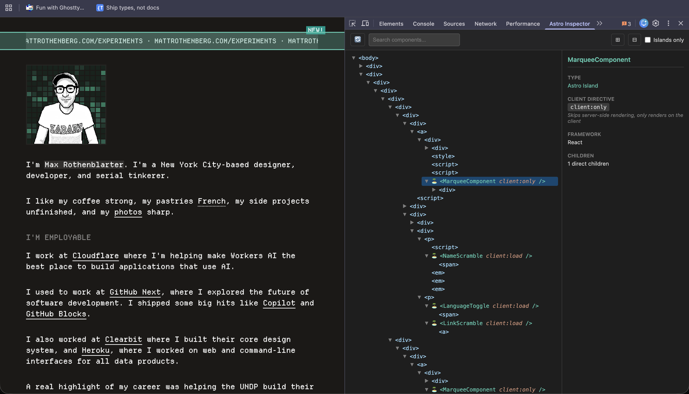

# Astro Inspector

A Chrome DevTools extension for inspecting [Astro](https://astro.build) websites. Quickly identify client-side islands and their hydration strategies without needing access to the source code.

> Based on [AstroSpect](https://github.com/oslabs-beta/AstroSpect). This is a rewrite with Manifest V3, DOM highlighting, and a simplified architecture.



## Features

- **Component Tree** - View the full DOM structure of any Astro page
- **Island Detection** - Astro islands are highlighted with a 🏝️ icon
- **Islands-Only Filter** - Toggle to show only hydrated components
- **Client Directives** - See which hydration strategy each island uses (`client:load`, `client:idle`, `client:visible`, etc.)
- **Framework Detection** - Identifies React, Vue, Svelte, Solid, and Preact components
- **Props Inspection** - View the props passed to each island
- **DOM Highlighting** - Hover over any element to highlight it in the page
- **Search** - Find components by name

## Installation

1. Clone this repository
2. Install dependencies and build:
   ```bash
   npm install
   npm run build
   ```
3. Open Chrome and navigate to `chrome://extensions/`
4. Enable "Developer mode" (toggle in top right)
5. Click "Load unpacked"
6. Select the `dist` folder

## Usage

1. Navigate to any Astro website
2. Open Chrome DevTools (F12 or Cmd+Option+I)
3. Click the "Astro Inspector" tab
4. Browse the component tree or toggle "Islands only" to filter

### Understanding Client Directives

| Directive        | Behavior                                |
| ---------------- | --------------------------------------- |
| `client:load`    | Hydrates immediately on page load       |
| `client:idle`    | Hydrates when the browser is idle       |
| `client:visible` | Hydrates when scrolled into viewport    |
| `client:media`   | Hydrates when a CSS media query matches |
| `client:only`    | Client-only rendering (skips SSR)       |

## Development

```bash
# Watch mode - rebuilds on file changes
npm run dev

# Type check
npm run typecheck
```

After making changes, click the refresh icon on the extension in `chrome://extensions/` to reload.

## How It Works

The extension uses `chrome.scripting.executeScript` to inject a script into the inspected page that traverses the DOM looking for `<astro-island>` elements. These custom elements are how Astro marks hydrated components, and they contain metadata about the component name, framework, props, and hydration strategy.

## License

MIT
